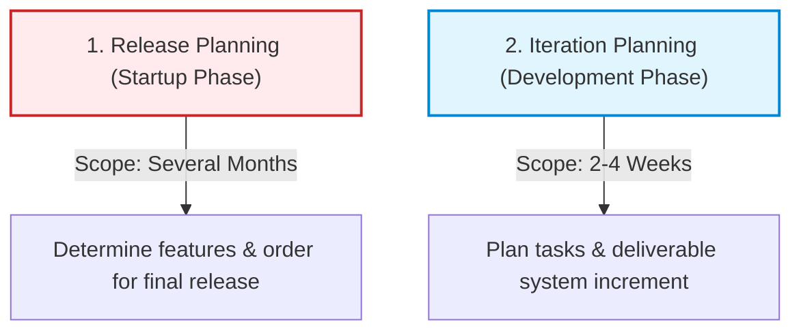
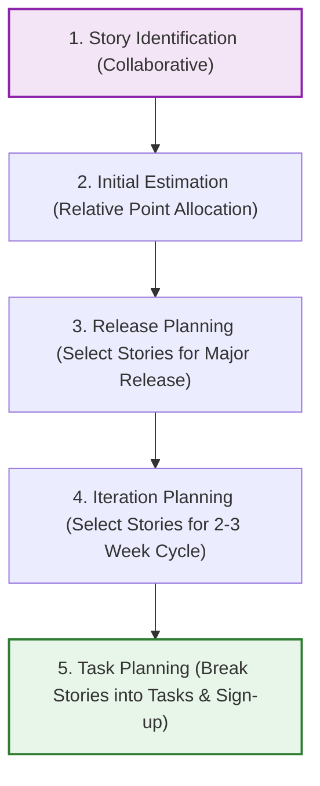

# Agile Planning
*(Based on Ian Sommerville, "Software Engineering" - Chapter 23)*

## 1. Introduction: Iterative and Flexible Planning
Agile software development is an iterative approach where systems are developed and delivered to customers in small increments. Unlike plan-driven development, the features of these increments are not locked in advance. Instead, they are decided dynamically during development based on changing customer priorities and team progress.

---

## 2. The Two Stages of Agile Planning
Agile projects split planning into two distinct time horizons:

1.  **Release Planning:** Looks ahead several months. The customer and development team decide on the broad features to be included in the next major release of the system.
2.  **Iteration Planning:** Focuses on the immediate future. The team plans the next system increment (typically representing **2 to 4 weeks** of development work).

---

## 3. The "Planning Game" Workflow
The **Planning Game** (originally from Extreme Programming) is a collaborative process between developers and customers to estimate and schedule features using **User Stories**:

### 3.1 Step 1: User Story Identification
*   Developers and customers co-write user stories representing required functionality.

### 3.2 Step 2: Initial Estimation (Relative Points)
*   Instead of estimating exact hours, the team uses **Relative Ranking**. 
*   They compare stories in pairs to decide which takes more effort.
*   They allocate notional **Story Points** (e.g., 2 points for simple tasks, 8 points for complex ones).
*   **Velocity:** The number of story points the team can implement per day. Velocity is estimated from past experience or by trialing a few initial stories, and is refined over time.
$$\text{Total Effort (person-days)} = \frac{\text{Total Story Points}}{\text{Velocity}}$$

### 3.3 Step 3: Release Planning
*   The customer selects and orders stories for the release. If the total points exceed the capacity for the selected release date, stories are pruned or added.

### 3.4 Step 4: Iteration Planning
*   Stories are selected for the upcoming 2–3 week iteration based on the team's velocity.

### 3.5 Step 5: Task Planning (Within an Iteration)
At the start of each iteration, developers break down stories into **Development Tasks**:
*   **Task Size:** A development task must take **between 4 and 16 hours**.
*   **Pull Model (Sign-up):** Individual developers sign up for the tasks they wish to implement, rather than being assigned work by a manager.

#### Benefits of Developer Sign-up:
1.  **Shared Overview:** The entire team reviews all tasks, improving coordination and highlighting dependencies.
2.  **Ownership and Motivation:** Selecting their own tasks gives developers a sense of ownership, increasing motivation and accountability.

---

## 4. Progress Review and Timeboxing (The Halfway Rule)
Agile planning enforces strict timeboxing. Sprints are completed on schedule, even if some features remain unfinished.

*   **The Halfway Rule:** Iteration progress is reviewed exactly halfway through the cycle. 
    *   *Rule:* Half of the story points and tasks must be finished. (e.g., in a sprint with 24 story points and 36 tasks, **12 story points and 18 tasks** must be complete).
    *   *Slippage Action:* If the team is behind, they do not extend the schedule. Instead, they immediately negotiate with the customer to **remove unfinished stories** from the increment.

> [!WARNING]
> **Impact on Customers:** While timeboxing ensures a working software increment is delivered on time, reducing the scope can disrupt customer business plans if they must adapt to incomplete software releases.

---

## 5. Limitations and Challenges of Agile Planning
1.  **High Customer Reliance:** The planning game depends on the constant availability and active involvement of customer representatives. If customers prioritize other work, planning breaks down.
2.  **Unfamiliarity:** Customers accustomed to traditional, detailed contract specifications may find the flexible, story-based planning game difficult to adopt.
3.  **Scaling Constraints:** Agile planning relies on close, face-to-face communication. It works best with small, stable, and co-located teams. For large, distributed, or high-turnover teams, collaborative planning becomes impractical, requiring a return to traditional plan-driven management.
