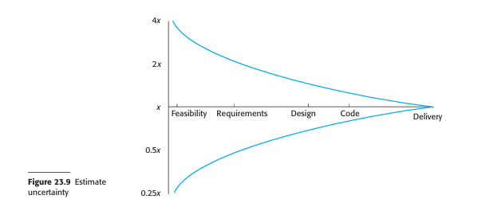

# Estimation Techniques in Software Projects
*(Based on Ian Sommerville, "Software Engineering" - Chapter 23)*

## 1. Introduction: The Difficulty of Estimation
Software cost and schedule estimation is one of the most challenging project management tasks. During the early stages of a project, managers must make estimates based on incomplete, loosely defined requirements. 

Furthermore, factors like unfamiliar platforms, new development technology, and undefined team skill levels introduce significant uncertainties.

### 1.1 The Cone of Uncertainty
In the startup phase of a project, estimates have a wide margin of error. Boehm discovered that initial effort estimates ($x$) can range from **$0.25x$ to $4x$** of the actual effort spent. As development progresses and requirements, design, and code are completed, the margin of error narrows (represented by the "Cone of Uncertainty").

---

## 2. Types of Estimation Techniques

### 2.1 Experience-Based Techniques
*   **Definition:** The estimate of future effort is based on the manager's informed judgment and historical data from previous projects in the same application domain.
*   **Best Practice:** Use group estimation (e.g., Wideband Delphi). Different team members explain their estimates, highlighting factors others might have missed, and iterate toward a consensus estimate.
*   **Limitation:** Fails when the project uses unfamiliar technologies, design methods, or frameworks (e.g., new web service APIs, HTML5), as past experience is no longer relevant.

### 2.2 Algorithmic Cost Modeling
*   **Definition:** Uses a mathematical formula to predict project effort based on estimated product size, complexity, and process/team attributes.
*   **Formula Origin:** Developed by analyzing the attributes and actual costs of completed historical projects to find a best-fit mathematical curve.

---

## 3. The Algorithmic Cost Modeling Formula
Most algorithmic models calculate project effort using this fundamental equation:

$$\text{Effort} = A \times \text{Size}^B \times M$$

Where:
*   **Effort:** Expressed in person-months (PM).
*   **A (Constant):** Represents organizational productivity, depending on local development practices and the type of software being built.
*   **Size:** The estimated code size (usually in **KLOC** - Thousands of Lines of Source Code) or functional size (Function Points / Application Points).
*   **B (Complexity Exponent):** Represents the complexity of the software and typically lies between **1.0 and 1.5**. 
    *   If $B = 1$, the effort scales linearly.
    *   If $B > 1$, there is a **diseconomy of scale** (e.g., doubling size requires *more* than double the effort due to increased communication links, integration issues, and configuration management complexity).
*   **M (Multiplier):** A product of cost drivers that adjust the effort based on team experience, reliability/safety requirements, tool support, and platform familiarity.

---

## 4. Software Productivity Note
*   **Definition:** Software productivity is the average development work completed per unit time (e.g., lines of code/month).
*   **Challenge:** It is difficult to compare individual developer productivity because the same functionality can be written in many ways, and code quality is subjective. Productivity metrics are only reliable when used across large groups.

---

## 5. COCOMO (Constructive Cost Model)
COCOMO is the most widely used algorithmic cost model, originally proposed by Barry Boehm.

### 5.1 The Three Project Modes in Basic COCOMO 81
1.  **Organic Mode:** Small, stable teams working on well-understood problems in a familiar environment (e.g., standard data processing systems).
2.  **Semi-detached Mode:** Intermediate complexity. Team members have mixed experience, and the software contains both familiar and new components (e.g., database management systems, compilers).
3.  **Embedded Mode:** High complexity. Tightly coupled to hardware and software constraints, strict operational requirements, and regulations (e.g., flight control systems).

### 5.2 Basic COCOMO Coefficients
$$\text{Effort (E)} = a \times (\text{KLOC})^b \quad [\text{Person-Months}]$$
$$\text{Development Time (D)} = c \times (E)^d \quad [\text{Months}]$$

| Project Mode | $a$ | $b$ | $c$ | $d$ |
| :--- | :--- | :--- | :--- | :--- |
| **Organic** | 2.4 | 1.05 | 2.5 | 0.38 |
| **Semi-detached** | 3.0 | 1.12 | 2.5 | 0.35 |
| **Embedded** | 3.6 | 1.20 | 2.5 | 0.32 |

---

## 6. Solved Numerical Examples

### **Problem Statement**
A software development project is estimated to have a size of **250 KLOC**. 
Calculate the **Effort**, **Development Time**, and **Average Staffing Requirement** for:
1.  Organic Mode
2.  Semi-detached Mode
3.  Embedded Mode

---

### **1. Organic Mode Calculation**
*   **KLOC** = 250
*   Formula: $E = 2.4 \times (250)^{1.05}$
$$E = 2.4 \times 329.08 \approx \mathbf{789.79 \text{ Person-Months}}$$

*   Formula: $D = 2.5 \times (789.79)^{0.38}$
$$D = 2.5 \times 12.63 \approx \mathbf{31.57 \text{ Months}}$$

*   **Average Staffing (S):**
$$S = \frac{\text{Effort}}{\text{Development Time}} = \frac{789.79}{31.57} \approx \mathbf{25.02 \text{ Persons}}$$

---

### **2. Semi-detached Mode Calculation**
*   **KLOC** = 250
*   Formula: $E = 3.0 \times (250)^{1.12}$
$$E = 3.0 \times 494.31 \approx \mathbf{1482.93 \text{ Person-Months}}$$

*   Formula: $D = 2.5 \times (1482.93)^{0.35}$
$$D = 2.5 \times 12.92 \approx \mathbf{32.30 \text{ Months}}$$

*   **Average Staffing (S):**
$$S = \frac{\text{Effort}}{\text{Development Time}} = \frac{1482.93}{32.30} \approx \mathbf{45.91 \text{ Persons}}$$

---

### **3. Embedded Mode Calculation**
*   **KLOC** = 250
*   Formula: $E = 3.6 \times (250)^{1.20}$
$$E = 3.6 \times 748.20 \approx \mathbf{2693.52 \text{ Person-Months}}$$

*   Formula: $D = 2.5 \times (2693.52)^{0.32}$
$$D = 2.5 \times 12.56 \approx \mathbf{31.40 \text{ Months}}$$

*   **Average Staffing (S):**
$$S = \frac{\text{Effort}}{\text{Development Time}} = \frac{2693.52}{31.40} \approx \mathbf{85.78 \text{ Persons}}$$

---

## 7. Key Limitations of Algorithmic Cost Modeling
1.  **Size Estimation Difficulty:** Early in the project, it is highly difficult to predict the exact size of the code (KLOC) because design choices (such as database reuse vs. custom development) haven't been finalized.
2.  **Subjectivity of Cost Drivers:** Determining complexity exponents ($B$) and multipliers ($M$) relies on subjective human judgment, which can vary significantly between different modelers.
3.  **Need for Calibration:** Models perform best when calibrated using local historical data, but very few organizations collect project metrics in a format that supports calibration.
