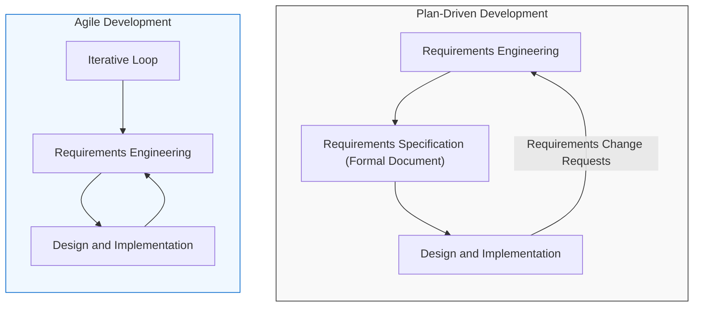

# Agile Software Development: Introduction to Agile Methods

_(Based on Ian Sommerville, "Software Engineering", 9th Edition)_

## 1. The Business Context & Need for Rapid Development

Agile Software Development is a software development methodology designed to deliver software quickly while accommodating changing customer requirements. It emphasizes collaboration, customer involvement, and frequent software releases.

- **Rapid Software Delivery:** Since software is integral to almost all business operations, rapid development and delivery is the most critical requirement for business systems today.

Important Points or need of agile

- Business environment changes quickly.
- Customers change their requirements often.
- Software must be delivered fast.
- Companies may accept slightly lower quality if they can launch earlier and beat competitors

---

## 2. Plan-Driven (Waterfall) vs. Agile Development

### Plan-Driven Development

- **Characteristics:** Completely specifies the requirements and then designs, builds, and tests the system in separate, sequential phases.
- **The Problem in Rapid Environments:** As requirements change, the system design and implementation must be extensively reworked and retested. This makes plan-driven processes lengthy, often delivering software long after it was originally specified.
- **When it is right:** Safety-critical control systems, where complete analysis, rigorous specification, and safety verification are absolutely essential.

### Agile Development

- **Characteristics:** Designed to produce useful software quickly by interleaving development activities.
- **Process Distinctions:**
  - **Plan-driven process:** Iteration occurs _within_ activities. Communication between stages is done via formal documents (e.g., a formal Requirements Specification document is passed to the design stage).
  - **Agile process:** Iteration occurs _across_ activities. Requirements and design are developed together, rather than separately.

### Comparison Diagram (Figure 3.1 Concept)

### Key Differences: Plan-Driven vs. Agile Development

| Plan-Driven (Waterfall)          | Agile                          |
| -------------------------------- | ------------------------------ |
| Requirements fixed first         | Requirements change anytime    |
| Development happens step by step | Development happens together   |
| Lots of documentation            | Minimal documentation          |
| Changes are expensive            | Changes are easy               |
| Software delivered at the end    | Software delivered frequently  |
| Suitable for stable projects     | Suitable for changing projects |

---

## 3. Common Characteristics of Agile Methods

Despite various agile frameworks (e.g., Extreme Programming, Scrum, DSDM), all agile methods share three common characteristics:

1.  **Interleaved Processes:**
    - Specification, design, and implementation are interleaved.
    - There is no detailed system specification.
    - Design documentation is minimized or generated automatically.
    - The user requirements document is simply an outline definition of the most important characteristics of the system.
2.  **Incremental Development:**
    - The system is developed in small, frequent increments (typically new releases every 2 to 3 weeks).
    - End-users and stakeholders are actively involved in specifying and evaluating each increment, proposing changes and new requirements for future versions.
3.  **Extensive Tool Support:**
    - Heavy reliance on tools to support the process, such as automated testing tools, configuration management systems, and user interface generators.
