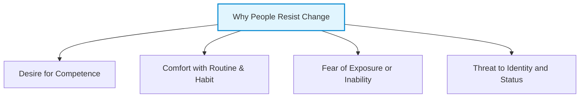

# The Agile Coach: Why People Don't Always Want to Change
*(Based on Andrew Stellman & Jennifer Greene, "Learning Agile" - Chapter 10)*

## 1. Introduction: The Human Element of Agile Transitions
While Agile methodologies (Scrum, XP, Lean, Kanban) provide frameworks, rules, and practices, the most critical part of any Agile transformation is the **human element**. Adopting Agile requires a fundamental shift in mindset, which is often met with significant resistance. 

An **Agile Coach** is responsible for guiding the team and the organization through this cultural transition. To do this effectively, the coach must possess empathy and understand the psychological reasons behind why people resist change.

---

## 2. Why People Don't Always Want to Change: Core Reasons
Stellman and Greene emphasize that resistance to change is rarely irrational or due to a lack of work ethic. Instead, it is a logical response driven by key human needs:

### 2.1 The Desire for Competence
*   **Intrinsically Motivated:** Most people in an organization genuinely want to do a good job and be recognized by their peers and supervisors as being **competent** at their tasks.
*   **The Threat of Change:** Over years of working in a traditional environment (e.g., plan-driven/Waterfall), employees develop expertise in specific tasks, tools, and processes. 
*   **The Challenge:** Introducing Agile disrupts this expertise. When asked to adopt an "entirely new way of doing things," employees fear they will lose their established mastery and be viewed as incompetent during the transition.

### 2.2 Comfort with Routine and Habit
*   **Cognitive Load:** Established habits and routines allow people to perform their work with lower cognitive effort and stress.
*   **Loss of Safety:** Abandoning routines creates uncertainty. A traditional process, even if inefficient, offers a predictable structure where responsibilities are clear-cut. Agile's self-organizing nature and collaborative decision-making can initially feel chaotic and unsafe.

### 2.3 Fear of Exposure
*   **Transparency:** Agile processes make progress, velocity, blockers, and mistakes highly visible (e.g., through Daily Scrums, Scrum Boards, and CFDs).
*   **Defensiveness:** Individuals who used to "hide" behind slow processes, lengthy documentation cycles, or individual handoffs may feel exposed by Agile's transparency. They resist change out of fear of criticism or blame.

### 2.4 Threat to Job Roles and Titles
*   Agile often collapses or redefines traditional job titles (e.g., project managers, business analysts, QA leads) into general roles like *Product Owner*, *ScrumMaster*, or simply *Development Team Member*.
*   People resist because they view their traditional titles as a reflection of their hard-earned career status and organizational identity.

---

## 3. The Agile Coach’s Philosophy
To overcome this resistance, an Agile coach must adopt a coaching mindset rather than a command-and-control approach:

1.  **Empathy and Non-Judgment:** Effective coaches do not judge resistance as laziness or incompetence. They recognize it as a normal human response to a threat to competence.
2.  **Meet People Where They Are:** A coach does not force a team to immediately reach the end-state of a "perfect" Agile process. They begin by understanding the team’s current mindset and current baseline process.
3.  **Create a Safe Environment (Psychological Safety):** The coach must establish an environment where team members feel safe to experiment, make mistakes, and learn. If people feel they will be punished for mistakes during the transition, they will cling to their old, safe habits.
4.  **Connect Change to Personal Value:** Instead of telling the team *how* to change, the coach helps them discover *why* the change benefits them (e.g., less stress, fewer fire drills, better collaboration, and higher pride in their work).
5.  **Incremental Learning:** Break the Agile transition into small, manageable steps. By allowing the team to master one practice at a time, the coach helps them maintain their sense of competence and build confidence.
