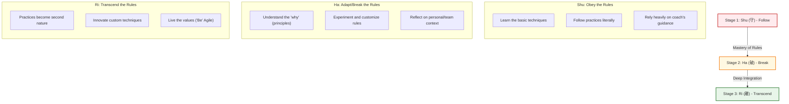

# Coaches Understand How People Learn
*(Based on Andrew Stellman & Jennifer Greene, "Learning Agile" - Chapter 10)*

## 1. Introduction: Learning as the Core of Agile Adoption
Agile is not merely a set of rules to be executed; it is a mindset that must be learned, understood, and internalized. For an Agile transition to succeed, team members must learn new ways of collaborating, thinking, and solving problems. 

An **Agile Coach** must understand the psychology of learning. If a coach simply enforces practices without understanding how people acquire skills, the team will only perform the activities mechanically (e.g., holding stand-ups but not communicating effectively) without actually becoming Agile.

To explain and guide this learning journey, Agile coaches frequently use the **Shuhari** (守破離) model.

---

## 2. The Shuhari Model of Mastery
Originating from Japanese martial arts (such as Aikido) and introduced to software development by Alistair Cockburn, **Shuhari** describes three distinct stages that a person or team passes through when learning and mastering a new skill, methodology, or practice.

### 2.1 Stage 1: Shu (守) — Follow/Obey the Rules
*   **Definition:** *Shu* translates to "protect" or "obey." It is the beginner/novice stage where the learner focuses on following the rules and fundamentals precisely as taught, without any deviation.
*   **The Learner's Perspective:**
    *   Learners lack the experience to evaluate or adapt the rules. They need clear, black-and-white guidance to perform the tasks.
    *   They look to the coach for exact instructions: *"Tell me exactly how to do this."*
*   **The Agile Coach's Role in Shu:**
    *   **Provide Structure:** Enforce the core practices of the chosen methodology literally (e.g., strictly keeping stand-ups to 15 minutes, updating the Kanban board daily, or adhering to a fixed sprint length).
    *   **Build Habit:** The goal is to build muscle memory and basic competence. Breaking or modifying rules at this stage leads to confusion and regression.
    *   **Maintain Safety:** By keeping rules simple and rigid, the coach helps the team feel secure, protecting their *desire for competence*.

### 2.2 Stage 2: Ha (破) — Break/Detach from the Rules
*   **Definition:** *Ha* translates to "break" or "detach." Once the fundamentals are mastered, the learner begins to branch out, understand the underlying principles and theory, and experiment with breaking or adapting the rules.
*   **The Learner's Perspective:**
    *   The team starts asking *why* specific rules exist. They begin to notice the relationship between their actions and outcomes.
    *   They start to customize practices: *"Now that we understand why we stand up every morning, we can tweak the format to better communicate our blockers."*
*   **The Agile Coach's Role in Ha:**
    *   **Teach Principles:** Explain the deep theories behind the practices (e.g., how WIP limits connect to Little's Law, or how Pair Programming relates to collective code ownership).
    *   **Encourage Controlled Experimentation:** Allow the team to customize their processes. The coach acts as a guardrail, ensuring that when the team breaks a rule, they do not violate the core principles of Agile.
    *   **Foster Reflection:** Guide the team to reflect on the outcomes of their experiments during Retrospectives.

### 2.3 Stage 3: Ri (離) — Transcend/Leave the Rules
*   **Definition:** *Ri* translates to "leave," "separate," or "transcend." At this stage of mastery, the learner is no longer constrained by rigid forms or rules. The rules are integrated so deeply into their behavior that they act naturally and intuitively.
*   **The Learner's Perspective:**
    *   The team does not need to look up a methodology book or refer to a rule sheet. Agile values (like collaboration, transparency, and feedback) are part of their daily mindset.
    *   They innovate entirely new techniques that are uniquely suited to their organization and context.
*   **The Agile Coach's Role in Ri:**
    *   **Step Back:** The coach transitions from a teacher/director to a peer, sounding board, or facilitator.
    *   **Promote Autonomy:** Let the team self-organize completely. The coach intervenes only when asked or in extreme cases of systemic issues.
    *   **Continuous Evolution:** Challenge the team to seek new horizons of performance and continuous improvement.

---

## 3. Key Coaching Principles for Effective Learning
Understanding *how* people learn guides the coach in several practical ways:

1.  **Do Not Rush the Transition:** A common mistake is pushing a team into the *Ha* or *Ri* stage before they have fully understood and practiced the *Shu* stage. If a team tries to customize a methodology before mastering its basic rules, they end up with a fragmented, ineffective process (often called "Agile in name only").
2.  **Align Coaching Style to the Learner's Stage:**
    *   A beginner team needs **direct instruction** (Shu).
    *   A developing team needs **mentoring and guiding** (Ha).
    *   An expert team needs **coaching and facilitation** (Ri).
3.  **Use Mistakes as Learning Tools:** People learn best when they make mistakes in a safe environment. Instead of telling the team how to avoid every mistake, a coach lets minor mistakes happen and uses Retrospectives to help the team discover the lesson themselves.
4.  **Emphasize Mindset over Mechanics:** Throughout all stages, the coach must repeatedly link daily practices back to Agile values. Learning a practice is useless if the underlying value (e.g., trust, collaboration) is not adopted.
