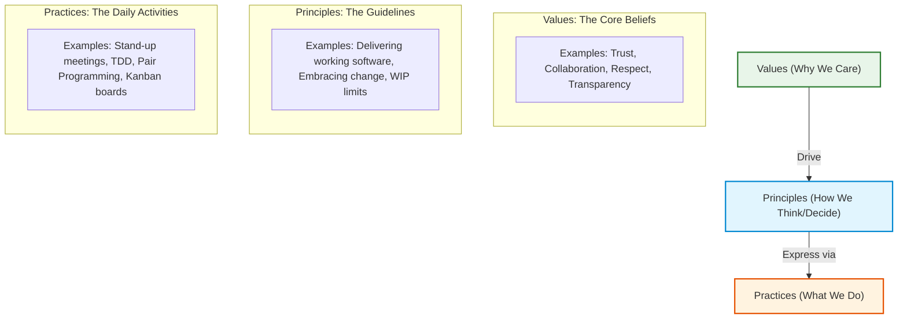

# Coaches Understand What Makes a Methodology Work
*(Based on Andrew Stellman & Jennifer Greene, "Learning Agile" - Chapter 10)*

## 1. Introduction: "Doing" Agile vs. "Being" Agile
Many organizations adopt Agile by introducing its ceremonies and rules—such as daily stand-ups, iteration planning, sprint reviews, and user stories. However, simply performing these activities (often called **"Doing Agile"**) does not guarantee success. Projects can still fail, and teams can still suffer from low morale and poor code quality.

An **Agile Coach** understands that what makes a methodology actually work is not just the execution of its practices, but the alignment of those practices with the underlying **principles** and **values** (often referred to as **"Being Agile"**).

---

## 2. The Triad of Methodology: Practices, Principles, and Values
Stellman and Greene define a methodology as a combination of three layers. To make a methodology work, a coach must ensure the team understands how these three layers connect.

### 2.1 Practices: "What We Do"
*   **Definition:** Practices are the concrete, visible activities, rules, and ceremonies of a methodology. 
*   **Characteristics:** They are easy to write down, teach, and observe. 
*   **Examples:** Writing User Stories, doing Daily Stand-ups, setting WIP limits, using Pair Programming.
*   **The Problem:** Practices are context-dependent. If a team applies them blindly (by rote) without understanding the other layers, the practices become empty bureaucratic overhead.

### 2.2 Principles: "How We Think"
*   **Definition:** Principles are the operational guidelines that connect practices to values. They help team members make decisions when the rules don't explicitly cover a situation.
*   **Characteristics:** They explain the reasoning behind the practices and help teams evaluate if their practices are working.
*   **Examples:** "Deliver working software frequently," "Welcome changing requirements," "Keep processes lightweight and transparent."
*   **The Problem:** Principles are still somewhat abstract and can be ignored if the team does not genuinely share the core values behind them.

### 2.3 Values: "Why We Care"
*   **Definition:** Values are the core philosophical beliefs and mindsets that drive the team’s culture.
*   **Characteristics:** They are the hardest to change and adopt because they require a shift in personal attitude, trust, and psychological safety.
*   **Examples:** Collaboration, Courage, Respect, Commitment, Focus.
*   **The Logic:** If a team does not value trust and respect, it is impossible for them to apply Agile principles or execute Agile practices successfully.

---

## 3. Case Study: The Daily Stand-up
To see how these layers interact, consider the **Daily Stand-up** meeting:

| Layer | State A: Just "Doing" Agile (Fails) | State B: Actually "Being" Agile (Succeeds) |
| :--- | :--- | :--- |
| **Practice** | The team meets daily for 15 minutes. Members stand in a circle and answer the three questions. | The team meets daily for 15 minutes. Members stand in a circle and answer the three questions. |
| **Principle** | The meeting is treated as a status report to the manager or ScrumMaster. | The meeting is treated as a collaborative replanning session to align daily work. |
| **Value** | **Lack of Trust/Respect:** Team members hide blockers, exaggerate progress, and avoid helping others out of fear of criticism. | **Transparency/Collaboration:** Team members openly share mistakes and blockers, trusting that peers will help rather than blame them. |
| **Outcome** | The meeting is a boring, useless ritual. Issues remain unresolved, and velocity drops. | The meeting is dynamic and useful. Blockers are resolved quickly, and team alignment is high. |

---

## 4. The Agile Coach's Strategy
To make a methodology work, the coach employs the following strategies:

1.  **Diagnose Failures at the Correct Layer:** When a practice fails (e.g., retrospective meetings are quiet and unproductive), the coach does not just force the team to follow the rules harder. Instead, they look down the chain: Is there a lack of trust (Value)? Are they missing the goal of continuous improvement (Principle)?
2.  **Coach the Values First:** The coach builds a culture of safety, collaboration, and trust. Practices are introduced as tools to express and reinforce these values.
3.  **Make Policies Explicit:** When introducing a practice, the coach clearly communicates the *principle* it supports. For instance, *"We use WIP limits (Practice) to manage and optimize flow (Principle) because we value sustainable pace and focus (Values)."*
4.  **Promote Self-Organization:** Once the team internalizes the values and principles, the coach allows them to adapt the practices. If the team decides to modify a practice, the coach evaluates the change based on whether it still honors the underlying values and principles.
