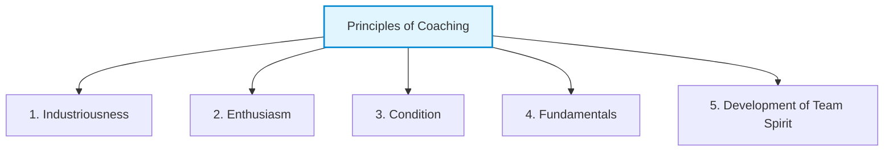

# The Principles of Coaching
*(Based on Andrew Stellman & Jennifer Greene, "Learning Agile" - Chapter 10)*

## 1. Introduction: John Wooden’s Influence on Agile Coaching
To explain what makes an effective coach, Andrew Stellman and Jennifer Greene draw a direct parallel between software engineering teams and sports teams. They base their **Principles of Coaching** on the philosophy of legendary UCLA basketball coach **John Wooden** (outlined in his book *Practical Modern Basketball*). 

Coach Wooden was famous for focusing deeply on the fundamentals of the game and building a cohesive team spirit, rather than just worrying about winning games. In an Agile context, a coach applies these exact same principles to build a high-performing software team that values continuous improvement, cooperation, and quality.

---

## 2. The 5 Principles of Coaching
The five coaching principles adapted from John Wooden are:

### 2.1 Industriousness (Hard Work and Active Growth)
*   **Sports Definition:** There is no substitute for hard work. Work must be planned, purposeful, and focused on self-improvement.
*   **Agile Coaching Translation:**
    *   **Not a "Plug-and-Play" Process:** Adopting Agile is not easy; it is an active, demanding process. It requires developers to learn testing, testers to participate in planning, and product owners to write clear requirements daily.
    *   **Focus on Planning & Improvement:** The coach ensures the team puts hard work into meetings like Retrospectives and Sprint Planning. These sessions must be treated as opportunities for active growth, not just box-checking exercises.
    *   **Leading by Example:** The coach model-behaves industriousness by actively preparing for team workshops, removing blockers, and offering support where needed.

### 2.2 Enthusiasm (Excitement and Infectious Positivity)
*   **Sports Definition:** A coach must truly love the game and have an infectious energy that inspires players to perform.
*   **Agile Coaching Translation:**
    *   **Agile Mindset is Infectious:** When team members are excited about the improvements they make (e.g., automated testing catching a critical bug early, or Kanban WIP limits reducing overtime), that enthusiasm spreads.
    *   **Role of the Coach:** An Agile coach must remain positive and excited about the team's potential, especially during stressful transition periods. 
    *   **Preventing Burnout:** Enthusiasm turns tedious "rules" into exciting, self-directed goals.

### 2.3 Condition (Mental and Environmental Readiness)
*   **Sports Definition:** Players must be in peak physical and mental condition. This requires rest, nutrition, and avoiding self-destructive habits.
*   **Agile Coaching Translation:**
    *   **Sustainable Pace:** Agile teams must work at a sustainable pace (a core XP principle). Exhausted developers write bad code, create technical debt, and stop communicating.
    *   **Psychological Safety:** A team’s "mental condition" relies on a blame-free environment. If they are afraid of being fired or blamed for mistakes, they cannot experiment or self-organize.
    *   **Removing Obstacles:** The coach protects the team's condition by shielding them from external corporate distractions, unrealistic deadlines, and micromanagement.

### 2.4 Fundamentals (Mastery of the Basics)
*   **Sports Definition:** A player cannot perform complex strategies if they cannot pass, dribble, or shoot correctly. Basketball practices must focus heavily on the basics.
*   **Agile Coaching Translation:**
    *   **Build the Foundation First (Shu stage):** A team cannot successfully customize their process if they haven't mastered basic practices (e.g., keeping Daily Stand-ups focused, writing testable user stories, or respecting WIP limits).
    *   **Beware of Overcomplication:** Coaches must steer teams away from complex tools or heavyweight processes. They keep the team focused on simple, working software and direct face-to-face communication.
    *   **Practice and Repeat:** The coach enforces repeated execution of core Agile ceremonies until they become second nature.

### 2.5 Development of Team Spirit (Unity and Collaboration)
*   **Sports Definition:** A team of average players working cohesively will beat a team of superstar individuals playing for themselves. Team spirit means sacrificing personal glory for the team's victory.
*   **Agile Coaching Translation:**
    *   **Address Individualism:** A coach must be vigilant against developers who hoard knowledge, refuse to collaborate, or focus entirely on individual metrics (like lines of code written or individual status).
    *   **Collective Ownership:** The coach nurtures a culture where the entire team is responsible for success or failure. If a sprint goal is missed, the *team* missed it, not just the testing department.
    *   **Shared Goal Alignment:** The coach helps the team define a shared purpose, encouraging cross-functional support (e.g., developers helping testers verify features at the end of a sprint).

---

## 3. Summary Mapping: Basketball vs. Agile Coaching

| Principle | Basketball Context (John Wooden) | Agile Development Context (Stellman & Greene) |
| :--- | :--- | :--- |
| **Industriousness** | Planning practices, executing drills, working on weaknesses. | Engaging fully in Scrum/XP practices, doing the hard work of self-correction. |
| **Enthusiasm** | Passion for the game, motivating players to work hard. | Celebrating team improvements, maintaining positive energy during sprints. |
| **Condition** | Physical fitness, stamina, healthy lifestyle. | Sustainable pace, high psychological safety, and focus. |
| **Fundamentals** | Dribbling, passing, shooting form, defense basics. | Simple user stories, basic Scrum/Kanban roles, clean code, TDD basics. |
| **Team Spirit** | Playing selflessly, passing to the open player. | Collective code ownership, collaborative planning, shared responsibility. |
