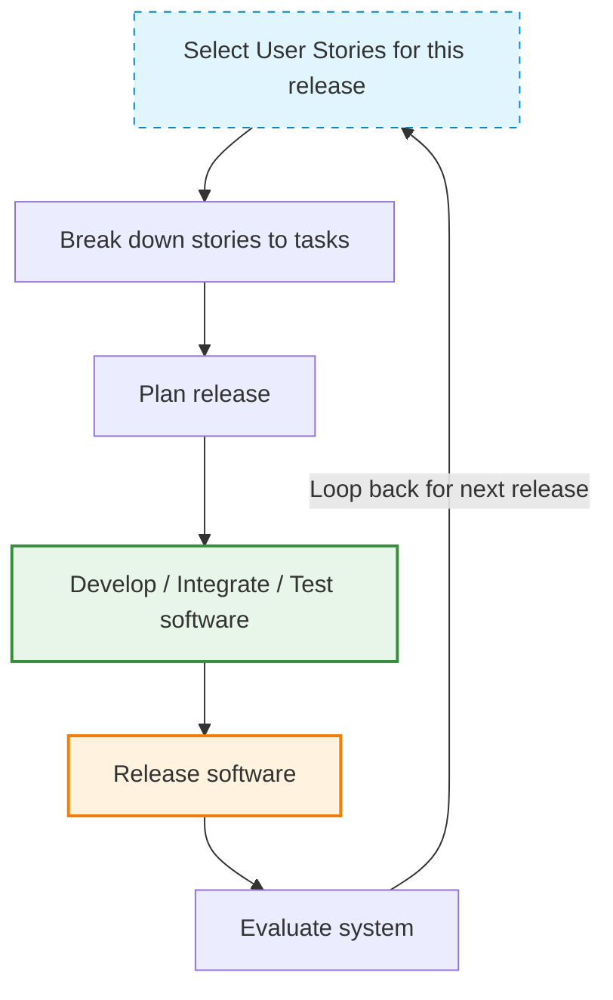

# Principles and Applicability of Agile Methods

_(Based on Ian Sommerville, "Software Engineering", 9th Edition)_

## 1. Plan-Driven vs. Agile: Background & Overhead

Before Agile, software was developed using **Plan-Driven (Waterfall)** methods.

### Suitability of Plan-Driven Methods

Plan-driven approaches work well for:

- **Large & Long-Term Projects:** Systems spanning multiple development teams working together.
- **Critical Systems:** Safety-critical and security-critical software where upfront specification and verification are mandatory.
- **High-Longevity Software:** Systems that will be maintained for many years by diverse engineers.

### Limitations for Small and Medium Projects

For small and medium-sized projects, traditional plan-driven methods create significant problems:

- **Excessive Process Overhead:** Too much upfront planning and heavy documentation.
- **Slow Delivery:** Development velocity is delayed by sequential phase sign-offs.
- **Requirement Shifts:** Requirements change frequently before the software is finished, rendering rigid specifications obsolete.

> [!NOTE]
> **The Origin of Agile:** Agile methods were introduced in the late 1990s to reduce process paperwork, eliminate process bureaucracy, and allow developers to focus on building working software quickly.

---

## 2. The Five Principles of Agile Methods

According to Ian Sommerville (Figure 3.2), all agile methods share a set of five core principles derived from the Agile Manifesto:

| Principle                | Description                                                                                                                                                                                                                                                           |
| :----------------------- | :-------------------------------------------------------------------------------------------------------------------------------------------------------------------------------------------------------------------------------------------------------------------- |
| **Customer Involvement** | Customers should be closely involved throughout the development process. Their role is to provide and prioritize new system requirements and to evaluate each iteration of the system.                                                                                |
| **Embrace Change**       | Expect the system requirements to change. Design the system to accommodate and welcome these changes rather than trying to prevent them.                                                                                                                              |
| **Incremental Delivery** | The software is developed in small increments, with the customer specifying the requirements to be included in each increment.                                                                                                                                        |
| **Maintain Simplicity**  | Focus on simplicity in both the software being developed and the development process itself. Actively work to eliminate complexity from the system wherever possible.                                                                                                 |
| **People, not Process**  | People, Not Process means Agile gives more importance to the skills and collaboration of the development team than to rigid rules and procedures. Developers are trusted to decide the best way to complete their work while focusing on delivering quality software. |

---

## 3. Applicability: Where do Agile Methods Succeed?

Agile methods have been particularly successful and are best suited for two kinds of system development:

### A. Product Development

- **Scenario:** A software company is developing a small or medium-sized product/app for sale.
- **Why Agile works:** The product manager acts as the customer, and decisions can be made quickly to adapt to market needs. Virtually all modern apps and software products are developed this way.
  ex: whatsapp, instagram etc

### B. Custom System Development (Within an Organization)

- **Scenario:** Developing a custom system for internal use within an organization.
- **Why Agile works:**
  - There is a clear commitment from the customer to be actively involved.
  - There are few external stakeholders or rigid regulations affecting the software.

### Key Success Factors for Agile Projects:

1.  **Continuous Communication:** Direct and continuous communication between the customer (or product manager) and the development team.
2.  **Stand-alone Systems:** The software is independent rather than tightly integrated with other systems under parallel development, eliminating the need to coordinate complex, parallel development streams.
3.  **Co-located Teams:** Small or medium-sized systems developed by teams working in the same location, allowing informal, face-to-face communications to work effectively.

---

## 4. The Extreme Programming (XP) Release Cycle

_(Reflecting the diagram flow in Figure 3.3)_

Extreme Programming (XP) is one of the most prominent agile methods. It relies on a highly iterative release cycle, diagrammed below:

- **Select User Stories:** Customers describe what they want from the system as "stories". The team selects stories to be implemented in the current release.
- **Break Down:** Selected stories are broken down into specific development tasks.
- **Plan:** The release schedule and tasks are planned.
- **Develop, Integrate, & Test:** The system is built, integrated, and fully tested.
- **Release:** The working software increment is released to the customer.
- **Evaluate:** The customer evaluates the released software, which feeds back into selecting new/modified user stories for the next iteration.
