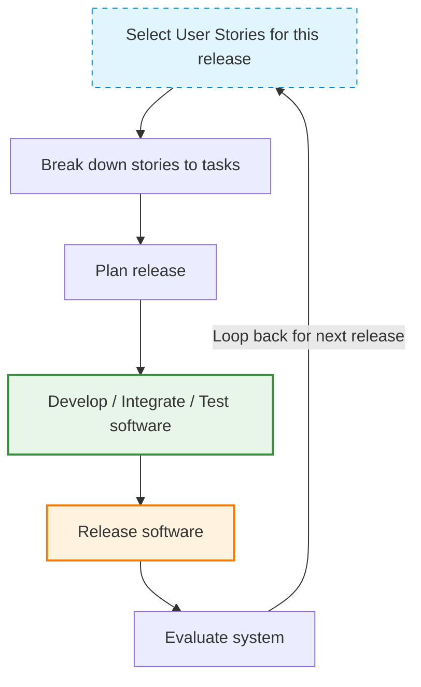

# Principles and Applicability of Agile Methods
*(Based on Ian Sommerville, "Software Engineering", 9th Edition)*

## 1. Plan-Driven vs. Agile: Background & Overhead
In the 1980s and early 1990s, software engineering prioritized careful planning, formalized quality assurance, rigorous development processes, and design tools. This plan-driven approach was developed for large, long-lived systems (e.g., aerospace control systems, which could take 10 years from specification to deployment) built by large, geographically dispersed teams.

*   **When Plan-Driven is Justified:**
    *   Coordinating the work of multiple development teams.
    *   Building safety-critical or security-critical systems.
    *   When many different people will maintain the software over its long lifetime.
*   **The Problem for Small/Medium Systems:**
    *   The planning and documentation overhead dominates the process.
    *   More time is spent on *how* the system should be developed than on programming and testing.
    *   Requirements change rapidly, making constant documentation updates and design rework highly inefficient.

Agile methods emerged in the late 1990s to cut through this process bureaucracy, allowing developers to focus on the software itself and deliver value quickly.

---

## 2. The Five Principles of Agile Methods
According to Ian Sommerville (Figure 3.2), all agile methods share a set of five core principles derived from the Agile Manifesto:

| Principle | Description |
| :--- | :--- |
| **Customer Involvement** | Customers should be closely involved throughout the development process. Their role is to provide and prioritize new system requirements and to evaluate each iteration of the system. |
| **Embrace Change** | Expect the system requirements to change. Design the system to accommodate and welcome these changes rather than trying to prevent them. |
| **Incremental Delivery** | The software is developed in small increments, with the customer specifying the requirements to be included in each increment. |
| **Maintain Simplicity** | Focus on simplicity in both the software being developed and the development process itself. Actively work to eliminate complexity from the system wherever possible. |
| **People, not Process** | Recognize and exploit the skills of the development team. Team members should be left to develop their own ways of working without prescriptive, rigid processes. |

---

## 3. Applicability: Where do Agile Methods Succeed?
Agile methods have been particularly successful and are best suited for two kinds of system development:

### A. Product Development
*   **Scenario:** A software company is developing a small or medium-sized product/app for sale.
*   **Why Agile works:** The product manager acts as the customer, and decisions can be made quickly to adapt to market needs. Virtually all modern apps and software products are developed this way.

### B. Custom System Development (Within an Organization)
*   **Scenario:** Developing a custom system for internal use within an organization.
*   **Why Agile works:**
    *   There is a clear commitment from the customer to be actively involved.
    *   There are few external stakeholders or rigid regulations affecting the software.

### Key Success Factors for Agile Projects:
1.  **Continuous Communication:** Direct and continuous communication between the customer (or product manager) and the development team.
2.  **Stand-alone Systems:** The software is independent rather than tightly integrated with other systems under parallel development, eliminating the need to coordinate complex, parallel development streams.
3.  **Co-located Teams:** Small or medium-sized systems developed by teams working in the same location, allowing informal, face-to-face communications to work effectively.

---

## 4. The Extreme Programming (XP) Release Cycle
*(Reflecting the diagram flow in Figure 3.3)*

Extreme Programming (XP) is one of the most prominent agile methods. It relies on a highly iterative release cycle, diagrammed below:

*   **Select User Stories:** Customers describe what they want from the system as "stories". The team selects stories to be implemented in the current release.
*   **Break Down:** Selected stories are broken down into specific development tasks.
*   **Plan:** The release schedule and tasks are planned.
*   **Develop, Integrate, & Test:** The system is built, integrated, and fully tested.
*   **Release:** The working software increment is released to the customer.
*   **Evaluate:** The customer evaluates the released software, which feeds back into selecting new/modified user stories for the next iteration.
