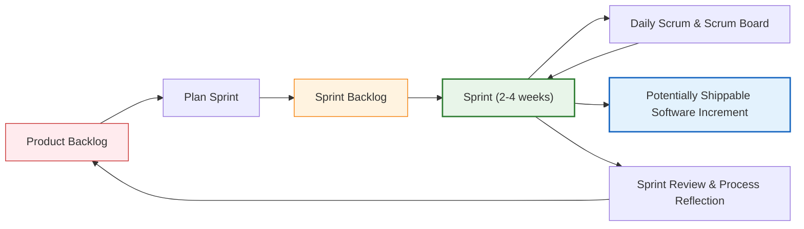
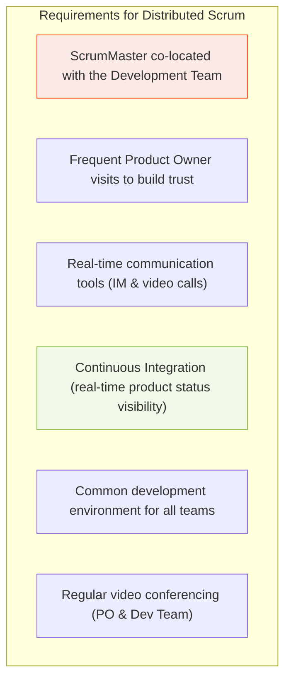

# Agile Project Management: Scrum
*(Based on Ian Sommerville, "Software Engineering", 9th Edition - Section 3.3)*

## 1. Plan-Driven vs. Agile Project Management
*   **Plan-Driven Management:** Managers draw up a plan showing what should be delivered, when it should be delivered, and who will work on it. This requires a stable view of requirements and processes.
*   **Agile Management Tension:** Early agile methods relied on informal planning, self-organizing teams, short cycles, and minimal documentation. This lacked the visibility and predictability required by large organizations.
*   **Scrum Solution:** Scrum is an agile method developed by Schwaber and Beedle that provides a framework for organizing agile projects, offering external visibility while adhering to agile manifesto principles. It does *not* mandate specific coding practices (like pair programming), making it highly adaptable and the most widely used agile method.

---

## 2. Scrum Terminology (Figure 3.8)

| Term | Definition |
| :--- | :--- |
| **Development Team** | A self-organizing group of software developers (ideally no more than 7 people) responsible for developing the software and essential documents. |
| **Potentially Shippable Product Increment** | The software increment delivered at the end of a sprint. It must be in a finished, fully tested state ready to be incorporated into the final product (though hard to achieve in practice). |
| **Product Backlog** | A prioritized "to do" list of features, user stories, requirements, or supplementary tasks (e.g., architecture design, user documentation) that the team must tackle. |
| **Product Owner** | An individual (or small group) who identifies product features, prioritizes the product backlog, and reviews it continuously to meet business needs. Acts as the customer or stakeholder representative. |
| **Scrum** | A short, daily face-to-face meeting of the team to review progress and prioritize the day's work. |
| **ScrumMaster** | Responsible for ensuring Scrum processes are followed, guiding the team, interfacing with the rest of the company, and shielding the team from outside distractions. *Not* a conventional project manager, though they may take on similar administrative duties in traditional business structures. |
| **Sprint** | A development iteration lasting between 2 and 4 weeks. |
| **Velocity** | An estimate of how much product backlog effort a team can cover in a single sprint. It is calculated based on previous sprints and is used to plan future sprint backlogs. |

---

## 3. The Scrum Sprint Cycle (Figure 3.9)

### Sprint Cycle Steps:
1.  **Sprint Planning:** At the start of the sprint, the Product Owner prioritizes the Product Backlog. The team reviews these items and selects what they can complete during the iteration based on their past **velocity**. This forms the **Sprint Backlog**.
2.  **The Sprint (Execution):** A fixed development period (2-4 weeks). **Sprints are never extended.** If work is unfinished, it is returned to the Product Backlog.
3.  **Daily Scrums:** Short, daily stand-up meetings. Team members share what they accomplished, what they plan to do next, and any blockers. A physical or digital **Scrum Board** (with "To Do", "In Progress", "Done" columns) is used to coordinate tasks.
4.  **Sprint Review & Retrospective:** At the end of the sprint, the team demonstrates the increment to stakeholders (product state evaluation) and reflects on the process to identify improvements for the next sprint.

---

## 4. Why Teams and Customers Like Scrum
1.  **Manageable Chunks:** The product is broken down into small, understandable pieces.
2.  **Embracing Unstable Requirements:** Changing requirements do not halt overall progress.
3.  **High Visibility:** The whole team has visibility into project status, boosting morale and communication.
4.  **On-Time Delivery:** Customers see frequent increments, eliminating last-minute surprises or delays.
5.  **Trust:** Regular delivery and collaboration foster trust between developers and customers.

---

## 5. Distributed Scrum (Figure 3.10)
In modern business, Scrum teams are often distributed globally to leverage lower costs, access specialist skills, and enable 24-hour development across time zones.

*   **The ScrumMaster** must stay close to the developers to address everyday problems.
*   **The Product Owner** and the development team must build trust, necessitating regular visits and video conferences.
*   **Continuous Integration** is vital to ensure all distributed members are aware of the system state.
