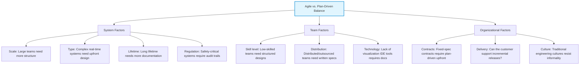

# Scaling Agile Methods

_(Based on Ian Sommerville, "Software Engineering", 9th Edition - Section 3.4)_

## 1. Introduction: Scaling Up vs. Scaling Out

Agile was originally designed for small, co-located programming teams developing small/medium business applications or software products using informal communication. Evolving these methods for large systems and corporate environments involves two facets:

1.  **Scaling Up:** Evolving agile methods to handle the development of **large software systems** that are too big for a single small team.
2.  **Scaling Out:** Evolving agile methods from specialized development teams to **widespread use across a large company** with years of legacy software experience.

---

## 2. Practical Problems with Agile Methods (Section 3.4.1)

Applying agile methods to large, long-lifetime systems for external clients presents three major challenges:

- **Contractual Issues:**
  Normally customers sign contracts with fixed requirements.
  Agile changes requirements frequently.
  So it's difficult to prepare fixed contracts.
- **Agile Maintenance Issues:** Agile focuses more on development.
  Later maintenance becomes difficult.
  Because
  - less documentation
  - original developers may leave
  - customer is no longer involved

### Agile Principles and Organizational Practice (Figure 3.11)

The principles in the Agile Manifesto can clash with real-world business environments:
Many Agile principles don't fit large companies.
Examples

- Customer unavailable
- Many stakeholders
- Long approval processes
- Strict company rules

---

## 3. Agile and Plan-Driven Hybridization (Section 3.4.2)

To scale, agile must integrate with plan-driven processes. Most large software projects combine practices from both approaches.

### Factors Influencing the Agile/Plan-Driven Balance (Figure 3.12)

---

## 4. Agile Methods for Large Systems

Large systems are vastly more complex than small systems, making pure agile approaches unviable.

### 4.1 Six Factors of Large System Complexity/ problems

1.  **System of Systems:** Collection of separate communicating systems developed by different, distributed teams. Prioritizing overall system integration is difficult.
2.  **Brownfield Development:** The new software must interact with existing legacy systems. Requirements are rigid and politically difficult to change.
3.  **System Configuration:** Much of the development involves configuring third-party software/components rather than writing original code, which conflicts with incremental integration.
4.  **Regulatory Constraints:** Detailed process and safety documentation are legally mandated.
5.  **Prolonged Procurement:** Long lifecycles make it impossible to keep the same team together, causing loss of system knowledge.
6.  **Diverse Stakeholders:** Too many stakeholders (e.g., nurses, doctors, managers in a hospital system) to represent effectively inside a small agile team.

### 4.2 IBM's Agility at Scale Model (ASM) (Figure 3.14)

IBM's model recognizes scaling as a three-stage progression:

1.  **Core Agile Development:** Focuses on construction, self-organizing teams, and a value-driven lifecycle.
2.  **Disciplined Agile Delivery (DAD):** Focuses on the full lifecycle (upfront requirements, architecture) and self-organizing teams with a governance framework.
3.  **Agility at Scale:** Adapts to scaling factors like team size, geographical distribution, regulatory compliance, technical complexity, and legacy systems.

### 4.3 Key Common Approaches to Scaling Up

- **Upfront Requirements:** A fully incremental approach to requirements is impossible. Initial high-level requirements are needed to allocate work to teams and define contracts.
- **Multiple Product Owners:** Since a single product owner cannot handle large systems, different owners manage different components and negotiate.
- **Upfront Architecture Design:** Architectural design and key documents (e.g., database schemas) must be established early to define team boundaries.
- **Cross-Team Communication:** Multi-channel communication (Scrum of Scrums, wikis, video conferences, IM) must be deliberately designed.
- **Frequent System Builds:** True continuous integration is impossible. Frequent scheduled system builds and robust configuration management tools are used instead.

### 4.4 Multi-team Scrum

Scrum is scaled for large projects by setting up multiple coordinated teams:

- **Role Replication:** Each team has its own Product Owner and ScrumMaster, coordinated by a chief Product Owner and chief ScrumMaster.
- **Product Architects:** Team architects collaborate to evolve the overall system architecture.
- **Release Alignment:** Release dates are aligned across teams to produce a complete demonstrable system.
- **Scrum of Scrums:** A daily meeting where representatives (often ScrumMasters) from each team meet to report progress, raise cross-team dependencies, and resolve blockers.

---

## 5. Agile Methods Across Organizations (Scaling Out - Section 3.4.4)

Scaling out (introducing agile across a large company) faces cultural and procedural barriers:

### Barriers to Adoption:

Large companies don't become Agile overnight.
Problems

- Managers resist change.
- Company rules are rigid.
- Employees have different skill levels.
- Existing testing processes conflict with Agile.

### Adoption Strategy:

Start with
One small Agile project.
If successful,
Expand gradually.
