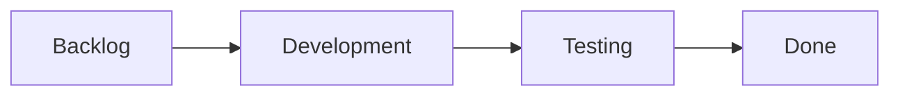
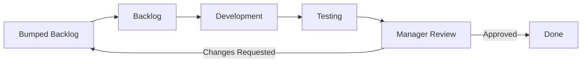

# Improving Your Process with Kanban
*(Based on Andrew Stellman & Jennifer Greene, "Learning Agile" - Chapter 9)*

## 1. Traditional Process Improvement vs. Kanban
Process improvement has been practiced since software engineering began, but typical corporate efforts often fail in practice.

| Aspect | Traditional Process Improvement | Kanban Process Improvement |
| :--- | :--- | :--- |
| **Sponsorship** | Senior managers sponsor the effort. | Driven and managed by the development team. |
| **Decision-Making** | Decisions are made by committees (e.g., SEPG) and handed down to developers. | Team members find problems in their own workflow and suggest solutions. |
| **Documentation** | Heavy, bureaucratic binders of documentation and boilerplate paperwork (compulsory reviews, minutes, empty test reports). | Minimal documentation; focuses on written, explicit team policies. |
| **Adoption** | Mandated from the top, leading to political compliance without real usage. | Teams hold themselves accountable to their own self-determined standards. |

---

## 2. Visualize the Workflow
The first step in Kanban process improvement is **visualizing** how the team currently works.

### 2.1 The "Warts and All" Principle
*   **The Trap:** When asked to write down their workflow, developers naturally include steps they *should* do (e.g., code reviews) even if they only do them occasionally.
*   **The Problem:** Documenting an idealized workflow masks actual bottlenecks. If code reviews are on the diagram, no one asks why they aren't happening (e.g., because senior members are too busy).
*   **The Kanban Way:** Write down exactly what the team does today, including all inefficiency, delays, and poor habits. This is rooted in the Lean values:
    *   *See the Whole:* Tinker with the workflow only *after* it is objectively understood.
    *   *Decide as Late as Possible:* Collect full baseline workflow data before deciding on changes.

### 2.2 Kanban Board Columns & Walk the Board
*   **Custom Columns:** Columns should not be copied from other teams; they must reflect the team's unique, studied workflow.
*   **Daily Meeting ("Walking the Board"):** The team meets daily to discuss each work item on the board. Items are moved (pulled) from left to right as they complete each step.

#### Workflow Case Study (The Phone App Team)
In a typical software team, the "happy path" workflow might look like this:


However, using a *Five Whys* analysis reveals the real workflow, including a manager bottleneck and reworked features:
*   Features must be demoed to senior management.
*   If management requests changes, the feature goes back to the beginning.
*   If features are bumped to a future release to make room, they are sent back to a "Bumped" backlog.

The realistic Kanban board includes these actual columns:

*Visualizing this makes the waste (mura - unevenness) and rework loops obvious to everyone, providing objective evidence of the bottleneck.*

---

## 3. Limit Work in Progress (WIP)
A team cannot perform infinite work at once. Multitasking and task switching can eat up to **50% of developer productivity**. 

### 3.1 What is limiting WIP?
Limiting Work in Progress means setting a strict maximum number of work items allowed in a specific stage of the workflow.

*   **Options Thinking:** Features in progress are options, not commitments. If the "Development" column is full, developers should not start writing code for another feature. Instead, they look at other options on the board (e.g., helping test, designing upcoming features, or clearing technical debt).
*   **Preventing Overburdening:** If the QA team is overloaded with 10 features, developers shouldn't push more features into testing. Limiting WIP protects the QA team from overburdening (*muri*).

### 3.2 Setting and Enforcing WIP Limits
*   **No Fixed Rules:** Teams choose a WIP limit that makes sense, and adjust it experimentally based on lead time measurements.
*   **The Agreement:** The team and managers agree on a policy. For example, setting a **WIP limit of 10** on the "Manager Review" column.

```
+-----------------------------------+
|       Manager Review              |
|          (WIP: 10)                |
|                                   |
|  [Item 1] [Item 2] [Item 3]       |
|  [Item 4] [Item 5] [Item 6]       |
|  [Item 7] [Item 8] [Item 9]       |
|  [Item 10]                        |  <-- WIP Limit Reached!
+-----------------------------------+
```

### 3.3 What happens when a WIP Limit is reached?
1.  **Stop Pushing Work:** No new work items can be advanced into that column, even if the work for them is finished.
2.  **Shift Focus:** Team members must stop starting new features and shift their focus to helping clear the bottleneck (e.g., helping testing, fixing bugs, or addressing technical debt).
3.  **Shorten Feedback Loops:** In the case study, reaching the limit of 10 in "Manager Review" forces the managers to hold their review meeting to clear the queue. This shortens the feedback loop, preventing work from sitting stale and getting bumped at the very end of the release.
