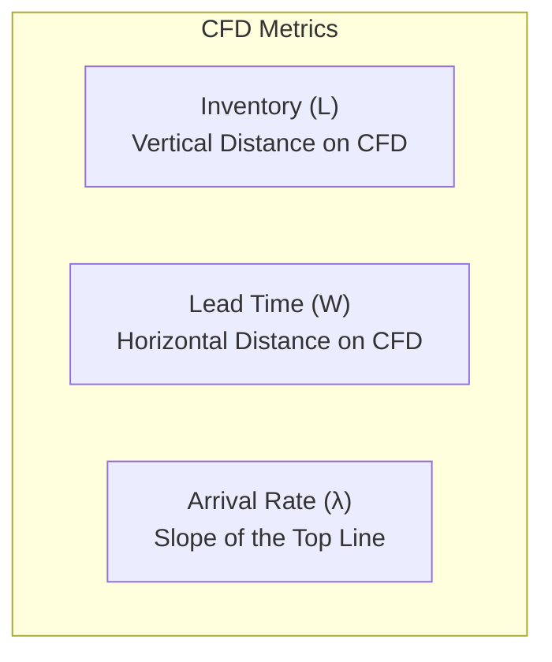

# Measure and Manage Flow & Make Process Policies Explicit
*(Based on Andrew Stellman & Jennifer Greene, "Learning Agile" - Chapter 9)*

## 1. What is "Flow" in Kanban?
*   **Definition of Flow:** The rate at which work items move through the software development system. 
*   **Maximized Flow:** Achieved when the team finds an optimal pace of delivery combined with a comfortable, non-disruptive feedback loop (avoiding thrashing).
*   **Disrupted Flow:** Caused by unevenness (*mura*) and overburdening (*muri*). Work piles up, developers spend time waiting on others, and the team experiences the "mired in muck" feeling (e.g., project plan is "90% done" but feels like 90% is left).
*   **The Goal of Kanban:** Increase flow. When flow increases, lead times decrease, and frustration drops.

---

## 2. Cumulative Flow Diagrams (CFDs)
A Cumulative Flow Diagram (CFD) is the primary tool used by Kanban teams to measure and manage flow over time.

### 2.1 CFD Structure
*   **Visual Base:** Built similarly to a WIP area chart, where stripes correspond to columns on the kanban board.
*   **Accumulation:** Unlike a WIP area chart where items leave the chart when done, in a CFD, work items accumulate in the final "Done" stripe. Thus, all stripes continue to rise over time.
*   **Core Metrics Tracked:**
    *   **Arrival Rate ($\lambda$):** The average number of work items entering the system daily (added to the first column).
    *   **Inventory ($L$):** The total number of work items currently in the active system (sum of all columns except "Done").
    *   **Lead Time ($W$):** The average time a work item spends in the system (how long the user waits).

### 2.2 System Stability & Trendlines
*   Kanban teams plot CFDs using spreadsheet tools (like Excel) to draw **linear trendlines** for both the arrival rate and inventory.
*   **Stable System:** Indicated by flat, horizontal trendlines, meaning work is entering and leaving the system at a constant, balanced rate.
*   **Unstable System:** Indicated by tilted trendlines (e.g., inventory rising over time). An unstable system causes rising lead times and developer burnout. WIP limits must be applied to stabilize the lines.

---

## 3. Little's Law (Queueing Theory)
Named after John Little, this theorem states a mathematical truth for any stable system:

$$\text{Inventory } (L) = \text{Lead Time } (W) \times \text{Arrival Rate } (\lambda)$$

Which can be rewritten to calculate lead time:

$$\text{Lead Time } (W) = \frac{\text{Inventory } (L)}{\text{Arrival Rate } (\lambda)}$$

### 3.1 Key Takeaways for Software Teams:
1.  **Reduce WIP to Reduce Lead Time:** In a stable system, you can directly cut your customers' wait time (lead time) simply by reducing the work in progress ($L$).
2.  **Lead Time and Quality:** David Anderson observed that longer lead times are associated with worse quality: *a 6.5x increase in average lead time resulted in a greater than 30-fold increase in initial defects*. Thus, reducing WIP is the primary leverage point for quality improvement.

---

## 4. Analogy: The Doctor’s Office Case Study

### 4.1 The Setup & Constraints (Natural WIP Limits)
A doctor's office has 5 exam rooms and 2 doctors. These are physical limits, meaning:
*   WIP limit for Exam Rooms = 5 patients.
*   WIP limit for Doctor Consultations = 2 patients.

### 4.2 The Problem
Patients arriving later in the day experience massive wait times in the waiting room (unstable system; inventory/queue keeps growing). Doctors feel rushed, compromising care.

### 4.3 The Kanban Solution
1.  **Visualize:** Draw a kanban board with columns: `Waiting Room`, `Exam Rooms`, `Doctor Consult`.
2.  **Set WIP Limit:** Establish a WIP limit of **6** on the `Waiting Room`.
3.  **Explicit Policy:** If there are already 6 patients in the waiting room, the staff reschedules incoming low-priority appointments (moving them to a later hour or next day) or asks for volunteers.
4.  **Class of Service:** Use different colored sticky notes to prioritize:
    *   *Pink Stickies:* Severe cases that cannot be rescheduled (high priority).
    *   *Yellow Stickies:* Minor issues that can flow normally or be rescheduled.

### 4.4 The Mathematical Verification (Little's Law)
*   **Scenario A (No Limit / Unstable):** Arrival rate ($\lambda$) = 11 patients/hour. Average Inventory ($L$) = 7.
    $$W = \frac{7}{11} = 0.63 \text{ hours} \approx 37 \text{ minutes average wait}$$
*   **Scenario B (WIP Limit Applied):** Arrival rate ($\lambda$) dropped to 10 patients/hour. Average Inventory ($L$) dropped to 4.
    $$W = \frac{4}{10} = 0.4 \text{ hours} = 24 \text{ minutes average wait}$$

---

## 5. Make Process Policies Explicit
A core Kanban practice is **writing down the rules** of how the team works and putting them in a highly visible place.

### 5.1 Tribal Knowledge vs. Explicit Policies
*   **Tribal Knowledge:** Unwritten, emergent rules (e.g., how scope changes are handled, who reviews code) that everyone follows but no one talks about.
*   **Explicit Policies:** Writing down these rules (e.g., "Definitions of Done", "Exit Criteria" at the bottom of kanban columns, or WIP limits).
*   **Why Explicit Policies are Critical:**
    *   *Eliminating Bureaucracy:* Exposing unwritten rules often reveals that they are wasteful or "stupid," allowing the team to collaboratively eliminate them.
    *   *Defensive Bureaucracy (CYA):* Developers or BAs often impose heavy processes (like complex change-control forms) defensively to avoid blame when scope changes. Making policies explicit helps the team address the root system issues rather than blaming individuals.
    *   *Enforcing WIP Limits:* Visible policies protect the team from external pressure. When an overeager manager tries to push more work onto a full column, the team has the explicit agreement to point to.
