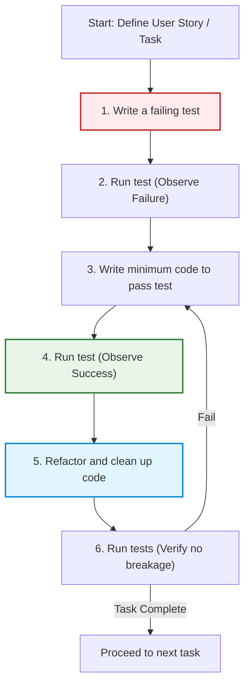
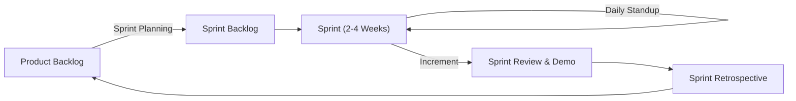
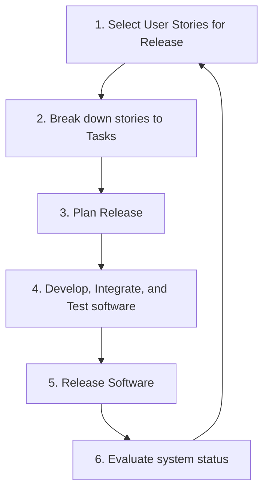

# Unit 5 Exam Question & Answer Guide
*(Comprehensive Guide Mapping Past Exam Questions to Model Answers and Diagrams)*

This guide contains structured model answers for the past exam questions, referencing the detailed notes files created in this unit.

---

## Question 1: Describe the working of agile development technique with a neat diagram. [8 Marks]
* **Related Notes:** [3.Agile-Development-Techniques.md](3.Agile-Development-Techniques.md)
* **Core Answer:** Focus on Test-Driven Development (TDD) as a primary agile technical practice.
* **Key Concept:** Write tests before writing functional code, execute tests, refactor, and repeat.
* **Diagram (TDD Cycle):**

---

## Question 2: Summarize the principles of coaching in agile methodology. [8 Marks]
* **Related Notes:** [13.The-Principles-of-Coaching.md](13.The-Principles-of-Coaching.md)
* **Core Answer:** Describe the 5 coaching principles adapted from legendary coach John Wooden's philosophy in *Practical Modern Basketball*:
  1.  **Industriousness:** Agile transformation is hard work; it is not plug-and-play. Coaches guide team members to embrace self-correction and learn cross-functional skills.
  2.  **Enthusiasm:** Coaches cultivate genuine excitement, which makes team members receptive to changes rather than feeling forced.
  3.  **Condition:** Ensuring mental readiness and a healthy environment. This relies on establishing a *sustainable pace* and *psychological safety* (blame-free culture).
  4.  **Fundamentals:** Enforcing the mastery of simple, foundational practices (such as clean coding, core Scrum meetings, or WIP limits) before customizing them.
  5.  **Development of Team Spirit:** Shifting the focus from individual career/status goals to collective team ownership and shared responsibility.

---

## Question 3: Describe the mechanism of agile project management with suitable example. [8 Marks]
* **Related Notes:** [4.Agile-Project-Management-Scrum.md](4.Agile-Project-Management-Scrum.md)
* **Core Answer:** Focus on **Scrum** as the primary framework.
* **Mechanism:** Iterative development controlled by fixed-length sprints (typically 2–4 weeks).
* **Roles:** Product Owner (manages backlog), ScrumMaster (facilitates & removes blockers), Development Team (self-organizing).
* **Ceremonies:** Sprint Planning, Daily Scrum, Sprint Review, Sprint Retrospective.
* **Example:** Developing a patient prescription system (e.g., Mentcare). The Product Owner prioritizes stories like "Prescribe medication" and "Check drug interaction." The team pulls these stories into a 2-week sprint, plans daily in Stand-ups, and delivers working, tested prescription software to stakeholders at the end of the sprint.
* **Diagram (Sprint Cycle):**

---

## Question 4: Demonstrate the way an organization may improve its development process implementing Kanban method. [8 Marks]
* **Related Notes:** [7.Improving-Process-with-Kanban.md](7.Improving-Process-with-Kanban.md) and [6.Kanban-Flow-and-Continuous-Improvement.md](6.Kanban-Flow-and-Continuous-Improvement.md)
* **Core Answer:** Organizations improve by following Lean principles and Kanban core practices:
  1.  **Visualize the Workflow:** Build a physical or digital Kanban board showing all work items ("warts and all") from backlog to delivery to uncover hidden queues and bottlenecks.
  2.  **Limit Work in Progress (WIP):** Set limits on how many tasks can be in each stage (e.g., maximum 3 items in "Development"). This forces the team to collaborate, finish current work ("stop starting, start finishing"), and prevents overloading.
  3.  **Manage and Measure Flow:** Focus on reducing lead time and cycle time.
  4.  **Make Process Policies Explicit:** Create clear rules (e.g., Definition of Done) so everyone has a shared understanding.
  5.  **Implement Feedback Loops:** Conduct regular stand-ups and service delivery reviews.
  6.  **Collaborative Improvement:** Use systems thinking to optimize the whole process, not just individual components.

---

## Question 5: Mention the responsibilities of an agile coach.
* **Related Notes:** [10.The-Agile-Coach-Why-People-Resist-Change.md](10.The-Agile-Coach-Why-People-Resist-Change.md)
* **Core Answer:** The responsibilities include:
  1.  **Guiding Cultural Transition:** Empathizing with and managing resistance to change (fear of exposure, loss of title, desire for competence).
  2.  **Facilitating Learning:** Moving the team through the stages of skill acquisition (**Shuhari** - Shu, Ha, Ri).
  3.  **Establishing Psychological Safety:** Creating a safe, blame-free environment where team members can experiment and learn from mistakes.
  4.  **Connecting Practices to Values:** Ensuring the team does not just perform Agile ceremonies by rote but understands the core Agile values (focus, openness, respect).
  5.  **Protecting Team Condition:** Insisting on a sustainable pace and resolving organizational blockers.

---

## Question 6: State the principles of Kanban.
* **Related Notes:** [6.Kanban-Flow-and-Continuous-Improvement.md](6.Kanban-Flow-and-Continuous-Improvement.md)
* **Core Answer:** The foundational principles of Kanban are:
  1.  **Start with what you do now:** Do not change roles or processes immediately; understand the current workflow first.
  2.  **Agree to pursue incremental, evolutionary change:** Improve step-by-step to avoid organizational shock.
  3.  **Respect the current process, roles, responsibilities, and titles:** Do not threaten people's titles or security initially; change will emerge naturally.
  4.  **Encourage acts of leadership at all levels:** Anyone on the team can suggest process improvements.

---

## Question 7: Discuss the five principles of Agile methodology. [5 Marks]
* **Related Notes:** [2.Principles-and-Applicability-of-Agile-Methods.md](2.Principles-and-Applicability-of-Agile-Methods.md)
* **Core Answer:** The five core principles from Ian Sommerville’s *Software Engineering* are:
  1.  **Customer Involvement:** Customers must be closely involved throughout the development process to define and prioritize requirements.
  2.  **Incremental Delivery:** The software is developed in increments, with the customer specifying the requirements to be included in each.
  3.  **People, Not Process:** The skills of the development team should be recognized and exploited. Team members should be left to develop their own ways of working without rigid bureaucracy.
  4.  **Embrace Change:** Design the system to accommodate changes easily and welcome changing requirements during development.
  5.  **Maintain Simplicity:** Focus on simplicity in both the software being developed and in the development process itself. Eliminate unnecessary complexity.

---

## Question 8: Explain the Extreme Programming (XP) release cycle. [8 Marks]
* **Related Notes:** [2.Principles-and-Applicability-of-Agile-Methods.md](2.Principles-and-Applicability-of-Agile-Methods.md)
* **Core Answer:** The XP release cycle is an iterative process where user stories are selected, broken down into tasks, developed, tested, and released.
* **Diagram (XP Release Cycle):**

---

## Question 9: Mention the advantages of Pair Programming.
* **Related Notes:** [3.Agile-Development-Techniques.md](3.Agile-Development-Techniques.md)
* **Core Answer:**
  1.  **Collective Code Ownership:** Both programmers understand the code, reducing key-person dependency.
  2.  **Continuous Code Review:** Errors are caught immediately by the observer, leading to higher code quality.
  3.  **Knowledge Sharing:** Junior developers learn coding standards and design practices from senior developers rapidly.
  4.  **Encourages Refactoring:** Having a partner provides the motivation to clean up and refactor code immediately rather than leaving it as technical debt.
  5.  **Comparable Productivity:** Studies (e.g., Williams/Arisholm) show that pair programming achieves similar overall speed to solo programming but results in significantly fewer bugs.

---

## Question 10: Summarize the role of Kanban in improving, measuring, and managing Workflow.
* **Related Notes:** [7.Improving-Process-with-Kanban.md](7.Improving-Process-with-Kanban.md) and [8.Measure-and-Manage-Flow.md](8.Measure-and-Manage-Flow.md)
* **Core Answer:**
  *   **Improving Workflow:** By visualizing the whole process "warts and all" and introducing WIP limits to eliminate multitasking, bottlenecks, and idle queues.
  *   **Measuring Workflow:** Using metrics like:
      *   **Lead Time:** Total time from creation to completion.
      *   **Cycle Time:** Time spent actively working on the task.
      *   **Cumulative Flow Diagrams (CFD):** Visual charts that track work items in various states over time, revealing flow patterns, bottlenecks, and trends.
      *   **Little's Law:** ($L = W \times \lambda$) linking average items in progress, lead time, and throughput.
  *   **Managing Workflow:** Making process policies explicit (e.g., clear Definition of Done) and utilizing **Classes of Service** (Standard, Expedite, Fixed Date, Intangible) to prioritize urgent tasks without derailing standard workflows.
