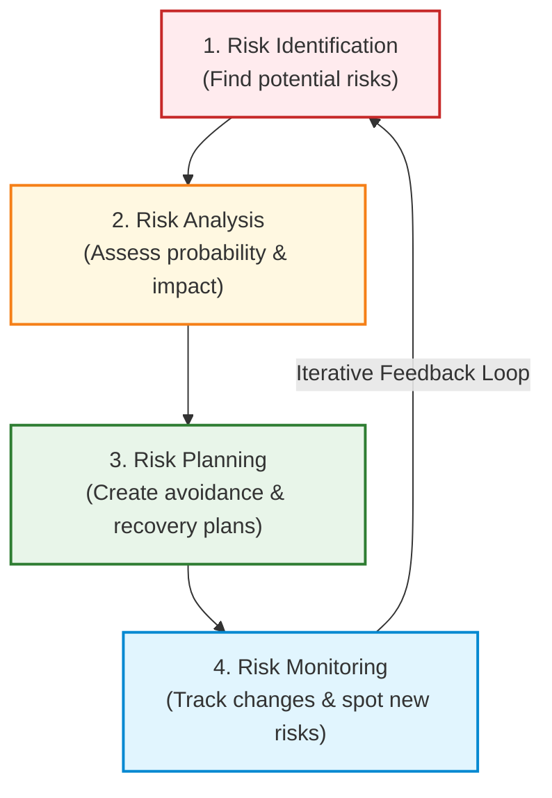
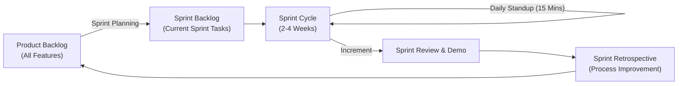

# Exam Revision Q&A: Software Engineering (Unit 4 & 5)
*(Answers written in simple, clear, and exam-ready English)*

---

## 2-Mark Questions

### Q1. State the four fundamental values of the Agile Manifesto that prioritize specific items over traditional processes and tools.
**Answer:**
The four core values of the Agile Manifesto are:
1. **Individuals and interactions** over processes and tools.
2. **Working software** over comprehensive documentation.
3. **Customer collaboration** over contract negotiation.
4. **Responding to change** over following a plan.

---

### Q2. Define the term "Refactoring" as it is applied within the context of Extreme Programming (XP).
**Answer:**
**Refactoring** is the practice of cleaning up, simplifying, and improving the internal design of the code without changing how it behaves on the outside. 
*   **Purpose:** It prevents code decay, makes it easier to read, and simplifies future changes.
*   **Examples:** Renaming variables for clarity, breaking large functions into smaller ones, and removing duplicate code.

---

### Q3. Identify the four essential stages of the Risk Management Process in software project management.
**Answer:**
The four essential stages are:
1. **Risk Identification:** Brainstorming and listing all potential risks that could go wrong.
2. **Risk Analysis:** Estimating the likelihood (probability) and impact (seriousness) of each risk.
3. **Risk Planning:** Devising strategies to avoid, minimize, or handle the risks.
4. **Risk Monitoring:** Continually checking the risks throughout the project to see if they have changed.

---

### Q4. What is the primary purpose of Software Pricing in software project planning?
**Answer:**
The primary purpose of software pricing is to determine the final cost/price quoted to the customer. It balances the actual **development costs** with **organizational business goals**, market competition, financial health, and project risks to win the contract while remaining commercially viable.

---

### Q5. Explain the specific role and responsibilities of the Scrum Master in the Scrum Framework.
**Answer:**
The **Scrum Master** is a facilitator and "servant leader" for the development team. 
*   **Key Responsibilities:**
    *   Ensuring the team follows Scrum rules and practices.
    *   Clearing blockers or obstacles that slow down developers.
    *   Protecting the team from external company distractions and micromanagement.
    *   Facilitating daily meetings, planning sessions, and retrospectives.

---
---

## 5-Mark Questions

### Q1. Contrast Plan-Driven Development and Agile Development by describing their core characteristics with respect to process activities and documentation.
**Answer:**

| Characteristic | Plan-Driven Development | Agile Development |
| :--- | :--- | :--- |
| **Approach** | Process-oriented and highly structured. | Iterative, flexible, and value-oriented. |
| **Planning** | Done entirely at the start of the project. | Done incrementally in cycles (sprints). |
| **Documentation** | Extensive. Requirements and designs are written down in detail before coding. | Minimal. Focuses on code and working software rather than heavy reports. |
| **Process Control** | Strictly follows defined steps and schedules. | Adapts dynamically to changing customer requirements. |
| **Team Style** | Formal management-driven task allocation. | Informal, collaborative, and self-organizing teams. |

---

### Q2. Define Pair Programming. Highlight the advantages of this practice introduced in Extreme Programming (XP).
**Answer:**
**Pair Programming** is an Extreme Programming (XP) practice where two developers work together at a single computer to write code:
1.  **The Driver:** Actively writes the code.
2.  **The Observer (or Navigator):** Reviews the code as it is typed, checks for bugs, and plans the design steps.

#### **Advantages of Pair Programming:**
*   **Higher Code Quality:** Continuous code review catches errors and bugs immediately, reducing rework later.
*   **Knowledge Sharing:** Developers share tips, shortcuts, and design skills. It is especially useful for training junior developers quickly.
*   **Collective Ownership:** Since two people wrote the code, key-person dependency is reduced. If one person leaves, the other can continue the work.
*   **Encourages Refactoring:** Having a partner provides social motivation to write clean, refactored code rather than leaving lazy "hacks."

---
---

## 10-Mark Questions

### Q1. Illustrate the Risk Management Process with a suitable diagram and explain all the stages involved in risk management.
**Answer:**

#### **Risk Management Process Diagram:**


#### **Explanation of Stages:**

1.  **Risk Identification:**
    *   *What it is:* The process of identifying potential threats to the project schedule, product quality, or business goals.
    *   *How:* Done via team brainstorming, checklists, or past project reviews.
    *   *Categories:* Estimation (wrong timelines), Organizational (budget cuts), People (staff illness/turnover), Requirements (scope changes), Technology (hardware/software failures), and Tools (underperforming tools).
2.  **Risk Analysis:**
    *   *What it is:* Assessing each risk to determine how likely it is to happen and how bad its impact will be.
    *   *Probability Bands:* Insignificant, Low, Moderate, High, or Very High.
    *   *Effect Bands:* Catastrophic (cancels project), Serious (major delay), Tolerable (minor delay), or Insignificant.
    *   *Outcome:* Risks are documented in a **Risk Register** sorted by seriousness so the manager knows which ones need immediate attention.
3.  **Risk Planning:**
    *   *What it is:* Devising strategies to address the top risks.
    *   *Strategies:*
        *   **Avoidance:** Actions to prevent the risk from happening (e.g., buying a commercial component instead of writing a risky, complex custom one).
        *   **Minimization:** Actions to reduce the damage if it does happen (e.g., cross-training staff so another developer can take over if someone falls ill).
        *   **Contingency:** Emergency recovery plans if the worst happens (e.g., preparing a budget justification document to fight corporate funding cuts).
4.  **Risk Monitoring:**
    *   *What it is:* Tracking the project regularly to check if old risks are disappearing, if their probability/impact has changed, or if new risks have emerged.
    *   *How:* Discussing key risks at every team review and watching indicators (e.g., high turnover indicates people risks; many change requests indicate requirement risks).

---

### Q2. Explain the Scrum Framework with a detailed description of: The Sprint Cycle, The Product Backlog, Scrum Roles, and Daily Scrum Meetings.
**Answer:**

Scrum is an Agile framework that helps teams deliver software in fixed-length iterations called **Sprints**.

#### **Scrum Sprint Cycle Diagram:**


#### **1. The Product Backlog:**
*   A prioritized list of all the features, requirements, bugs, and improvements needed in the software.
*   Managed and updated constantly by the **Product Owner** to reflect changing customer priorities.

#### **2. Scrum Roles:**
*   **Product Owner:** Represents the customer. They decide *what* needs to be built and prioritize the Product Backlog.
*   **Scrum Master:** A facilitator who ensures the team follows Scrum rules, removes development blockers, and shields the team from external distractions.
*   **Development Team:** A self-organizing, cross-functional group of 3–9 engineers who write, test, and deliver the working software increment.

#### **3. The Sprint Cycle:**
*   A **Sprint** is a fixed-duration development cycle lasting **2 to 4 weeks**.
*   **Planning:** At the start, the team selects items from the Product Backlog that they commit to delivering during the sprint.
*   **Review & Demo:** At the end, the team demonstrates working software to stakeholders.
*   **Retrospective:** The team reflects on *how* they worked and plans process improvements for the next sprint.

#### **4. Daily Scrum Meetings (Daily Stand-up):**
*   A short, **15-minute daily meeting** where the team aligns their work.
*   To keep it brief, members stand up and answer three simple questions:
    1.  *What did I do yesterday?*
    2.  *What will I do today?*
    3.  *Are there any blockers/impediments in my way?*

---

### Q3. Discuss the Project Scheduling Process in software project management. Explain how milestones and deliverables are used. With an example, illustrate how a project manager represents the schedule and staff allocation using Bar Charts (Gantt Charts).
**Answer:**

#### **The Project Scheduling Process:**
Project scheduling is the process of breaking down the overall work of a project into separate tasks, estimating calendar times, resource needs, and allocating engineers. 

#### **Milestones and Deliverables:**
*   **Milestones:** Internal review points at the end of a project stage. They require no customer delivery and are documented with brief internal progress reports/emails (e.g., "Architecture design finalized").
*   **Deliverables:** Substantial work products delivered directly to the customer as specified in the contract (e.g., "Completed User Manual" or "Beta Release of Code").

#### **Gantt Chart Example (Schedule and Staff Allocation):**
Assume a project has 4 tasks:
*   **T1:** (10 days, assigned to Ali, no dependencies).
*   **T2:** (5 days, assigned to Jane, no dependencies).
*   **T3:** (10 days, assigned to Ali, depends on T1).
*   **T4:** (15 days, assigned to Geetha, depends on T2).

#### **Schedule Bar Chart (Gantt Chart):**
Shows task start dates, durations, and milestone endpoints.
```text
Days: 0....5....10...15...20...25
T1   [==========] (Ends Day 10 - Milestone M1)
T2   [=====] (Ends Day 5 - Milestone M2)
T3              [==========] (Starts Day 11, Ends Day 20)
T4        [===============] (Starts Day 6, Ends Day 20)
```

#### **Staff Allocation Chart:**
Shows who is working on what task over time.
```text
Days:   0....5....10...15...20...25
Ali     [== T1 ===][=== T3 ===]
Jane    [= T2 =]   (Idle / assigned elsewhere)
Geetha       [==== T4 ========]
```
*   *Interpretation:* Ali works on T1 for the first 10 days, then immediately transitions to T3. Jane works on T2 for 5 days and is then free. Geetha starts T4 on Day 6 after T2 completes.

---

### Q4. Discuss how Software Pricing is determined during software project planning. Explain any five factors that influence the price quoted for a software product.
**Answer:**

In software planning, pricing is not simply calculated as "cost plus profit." Broad economic, political, and corporate strategies are evaluated. 

#### **Five Factors Influencing Software Pricing:**
1.  **Contractual Terms:** If the customer allows the software developer to retain the source code rights to reuse or sell in other markets, the developer may significantly lower the quoted price.
2.  **Cost Estimate Uncertainty:** If a manager is unsure of how long development will take (e.g., due to a new database engine or platform), they will increase the price by adding a contingency cost buffer.
3.  **Financial Health of the Developer:** If a software company is in financial distress, it may quote a very low, break-even price to ensure cash flow, pay salaries, and prevent bankruptcy.
4.  **Market Opportunity:** A company may quote a very low price to enter a new market segment, build a reputation, or gain technical experience, aiming to make a greater profit on future projects.
5.  **Requirements Volatility:** If requirements are unstable and likely to change, a developer may bid a low price to win the contract, planning to charge high profit-margin prices for requirements change requests later.
